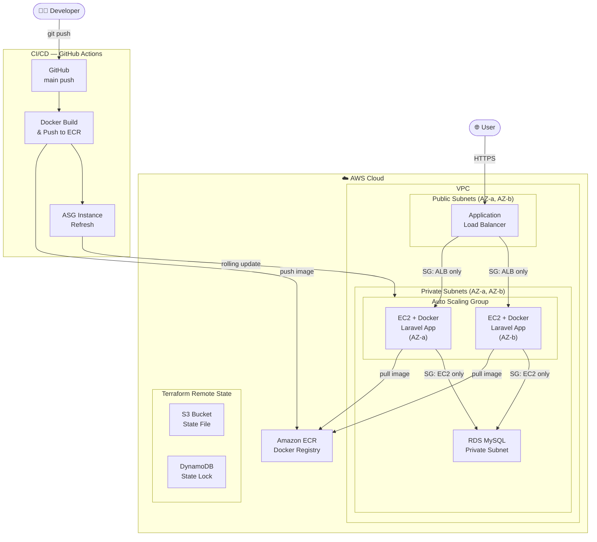

## Overview
A Laravel-based health/appointment website that I developed myself. This repo covers containerizing it with Docker and deploying it to AWS (EC2, ALB, RDS, ASG) using Terraform, along with the GitHub CI/CD process.
Note: This project does not cover the development stages of the Laravel application itself — it only explains the AWS deployment stages.

---

## Architecture

---

## Docker
We used Docker because it lets us define all the dependencies our Laravel project needs to run (PHP, nginx, PHP extensions, etc.) just once, and have them set up the same way in every environment. This removes the classic "it worked on my machine" problem.
We do this with the Dockerfile: it installs all the required dependencies and copies the project into the image. In the .dockerignore file we list the files and folders we don't want included in the image, such as .env, vendor, and node_modules, so that unnecessary files don't bloat the image and sensitive data like .env doesn't leak.
Finally, we push the image we built to ECR (AWS's Docker image registry) so that AWS can pull it from there and run it.

## Infrastructure (Terraform)
We used Terraform to build the entire AWS infrastructure as code (Infrastructure as Code), instead of creating everything manually from the AWS console. The infrastructure includes a custom VPC with public and private subnets spread across two different availability zones, an Application Load Balancer (ALB) that receives the traffic, an Auto Scaling Group (ASG) that runs the EC2 instances, and an RDS MySQL database located in the private subnets. The EC2 instances run the Laravel application inside a Docker container and pull the image from ECR.
Security is handled with three chained security groups: the ALB accepts traffic from the internet, the EC2 instances accept traffic only from the ALB, and the RDS database accepts traffic only from the EC2 instances. This way, the database stays completely closed to the outside world.
To deploy, the commands terraform init, terraform plan, and terraform apply are run in order. Sensitive values such as the database password are kept in a terraform.tfvars file, which is not pushed to the repo

## CI/CD
To automate the deployment process, we set up a CI/CD pipeline with GitHub Actions. On every code push to the main branch, the pipeline runs automatically: it builds the Docker image, pushes it to ECR, and then triggers an instance refresh on the Auto Scaling Group so the EC2 instances are updated with the new image. This way, code changes go live without any manual steps. The AWS access keys are stored securely in GitHub Secrets instead of being hardcoded

Instead of keeping the Terraform state in a local file, I configured a remote backend. The state is stored in an S3 bucket, and DynamoDB is used for state locking so the state can be shared safely across a team.

